Numpy Documentation
===================

Installation
------------

~~~~~~~~~~~~~~~~~~~~~~~~~~~~~~~~~~~~~~~~~~~~~~~~~~~~~~~~~~~~~~~~~~~~~~~~~~~~~~~~
pip install numpy
conda install numpy
~~~~~~~~~~~~~~~~~~~~~~~~~~~~~~~~~~~~~~~~~~~~~~~~~~~~~~~~~~~~~~~~~~~~~~~~~~~~~~~~

Import
------

Numpy Python library can be imported using the following command

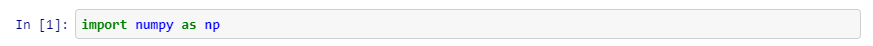

**Converting Lists into Numpy Arrays**

Use the np.array cmd which can take in a parameter of a list, to convert a
regular python list into a Numpy Array

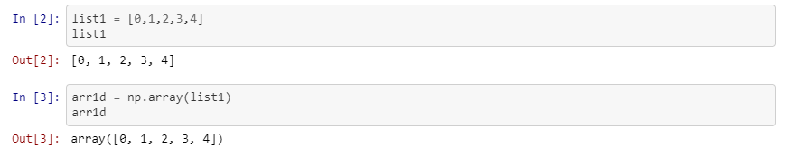

**NOTE: Elements cannot be appended into Numpy Arrays since memory has already
been allocated**

The append cmd can be used to append elements into lists. However, this command
doesn’t work with numpy arrays

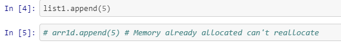

**Creating Multi-dimensional Numpy Arrays**

Similarly, when nested lists are passed into the np.array() cmd, the list is
converted into a 2d array

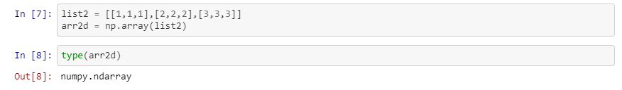

The Data-type can also be checked using the dtype cmd

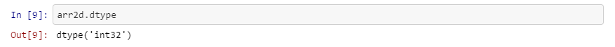

When converting the list into a numpy array, the data-type of the elements can
be modified using the dtype parameter

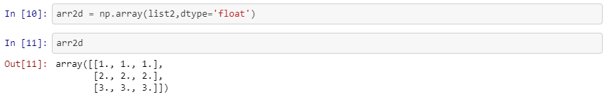

The astype () cmd can be used to cast a particular object into the desired dtype

Using the inplace=False parameter doesn’t modify the original data

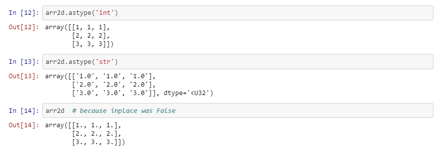

**Converting Numpy array back to list**

The original list can retrieved by using the tolist() cmd

**Gathering Useful information regarding the Numpy array**

The statistics regarding unidimensional or multidimensional data can be found
using the shape, dtype, size and dimension keywords

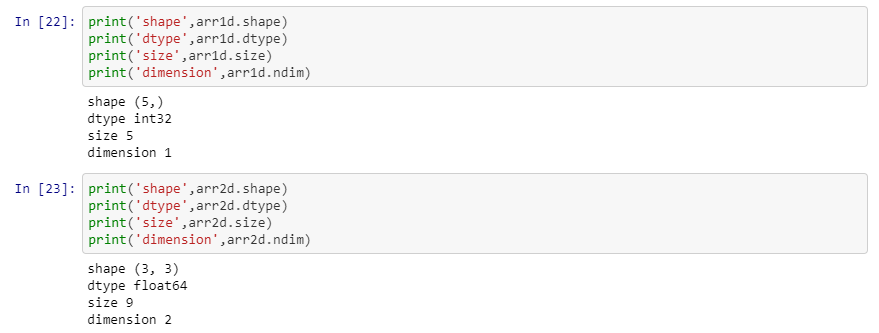

**Printing the contents of the Numpy Array**

The contents of the numpy array can be revealed simply using the print () cmd.

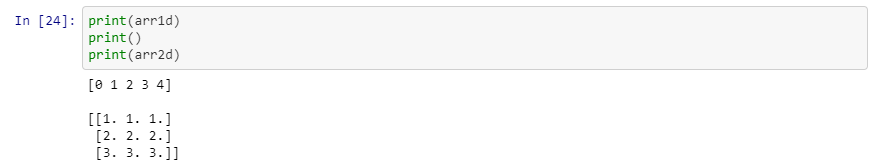

**Accessing elements of the Array**

The elements in the array can be accessed simply using the indices in square
brackets succeeding the numpy array name as illustrated below

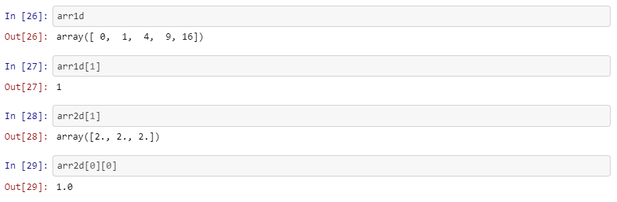

Further desired conditions can be applied according to the user and the same can
be passed into the indices of the numpy array to retrieve the elements matching
the particular condition.

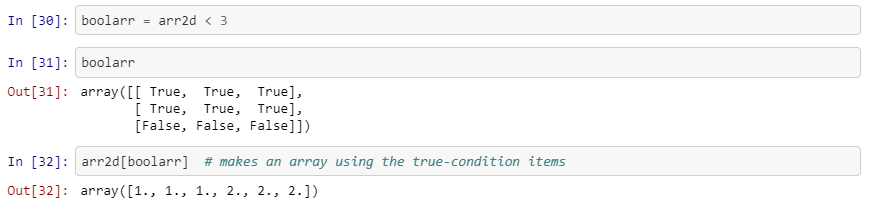

**Reversing rows, columns or both**

The Numpy rows, columns or both can reversed by passing in -1 while slicing the
numpy array as illustrated below.

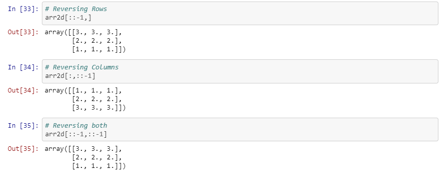

**Numpy also supports NULL and INFINITE values**

This can be implemented using np.nan and np.inf respectively

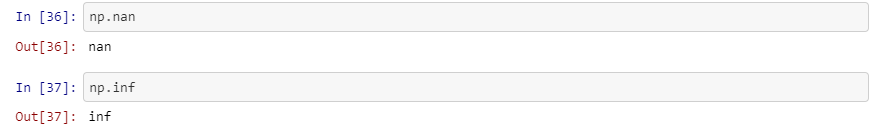

**Checking for NULL and INFINITE values in the Numpy Arrays**

The null and infinite values in the numpy arrays can be checked using the
isnan() and isinf () cmd.

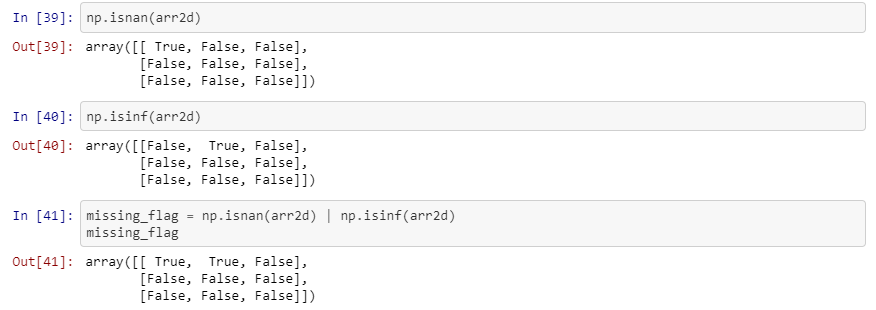

The missing nan and inf values can replaced by accessing the numpy as
illustrated before

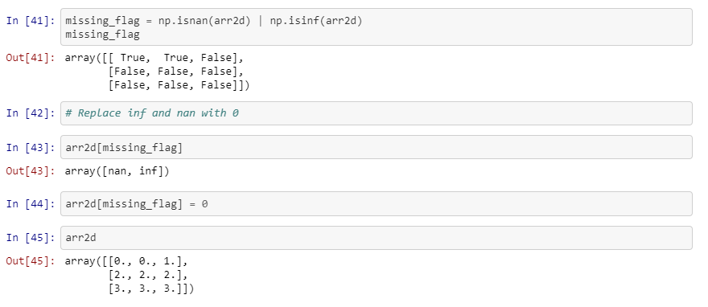

**Statistical Operations**

Statistical Operations can be performed on the numpy array using the mean (),
std (), max (), min (), etc. cmds.

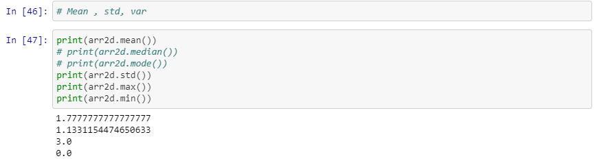

The array can be squeezed using the squeeze command

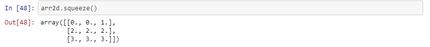

The cumulative sum of the array can be evaluated using the cumsum () command

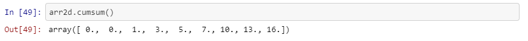

**Reshape, Flatten and Ravel**

The array can be reshaped, flattened (converted into a 1d array) and raveled
(also converted into a 1d array and in-place)

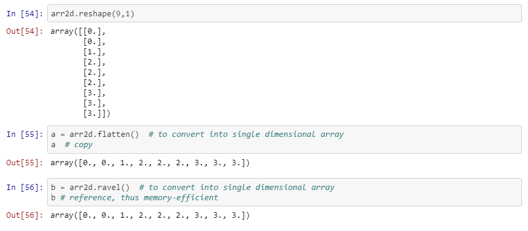

Sequences, Repetitions and Random Numbers
=========================================

A sequence of real numbers can be generated within a range using the arrange
command and also passing the desired dtype parameter.

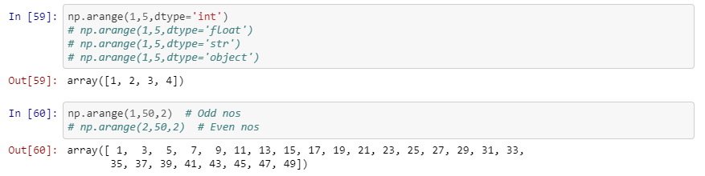

A sequence of linearly or logarithmically spaced real numbers can be inserted
between 2 limits using the linspace cmd () or logspace() cmd

**Constructing Matrices with all zeroes and ones as elements**

These types of matrices can be constructed using the zeroes () and ones () cmd

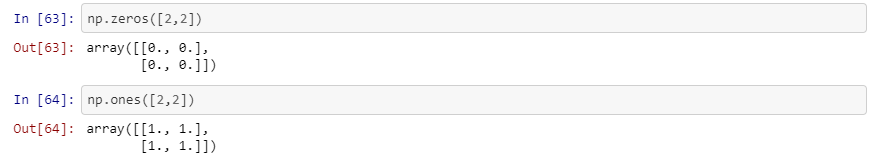

**Random Numbers**

Numpy has a random module which can be used to generate random required number
of floating numbers or integers within a given range.

Random.seed() is a starting point in generating random numbers

Random.randint() is used for generating random integers

Random.rand() and Random.randn() are used for generating random real numbers
between 0 and 1. Additionally while rand generates numbers randomly where as
randn makes sure that the random makes sure that the numbers generated follow a
Bell-shaped Normal Gaussian Distribution curve.

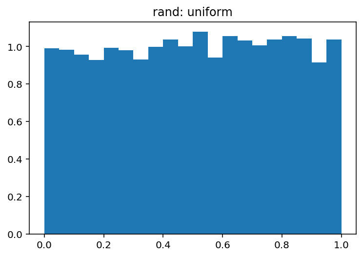

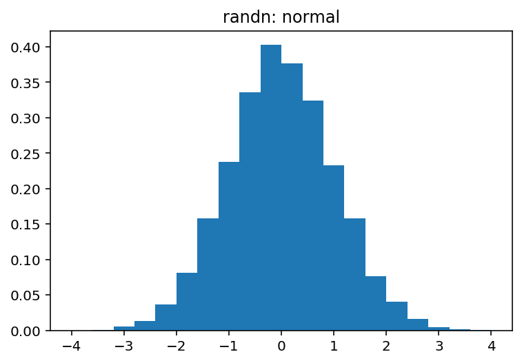

The following codes illustrate randomly generated real numbers using the random
package module of Python:

**Sorting a Numpy Array**

The Numpy arrays can be sorted using the sort () cmd.

In Numpy

Axis =0 denotes Columns

Axis =1denotes Numpy

In Pandas

Axis =0 denotes Rows

Axis =1denotes columns

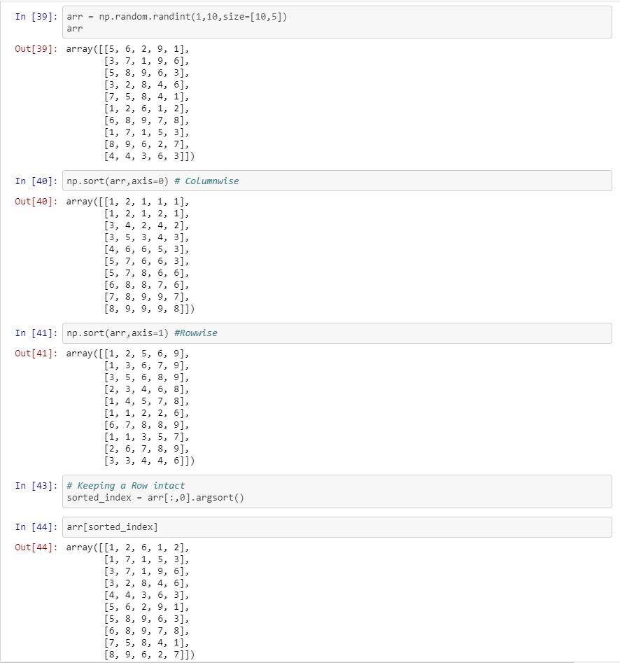

**Working with Numpy datetime64 submodule**

Numpy has module called datetime64 to handle with dates

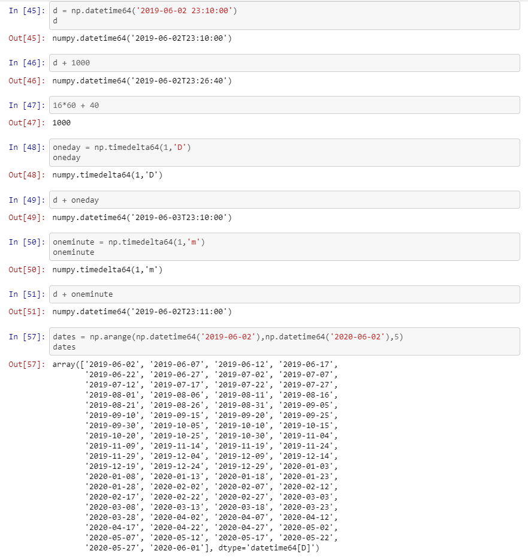

**Numpy Advanced Functions**

There are several in-built advanced Numpy functions like vectorize () which
makes handling multi-dimensional arrays easier.

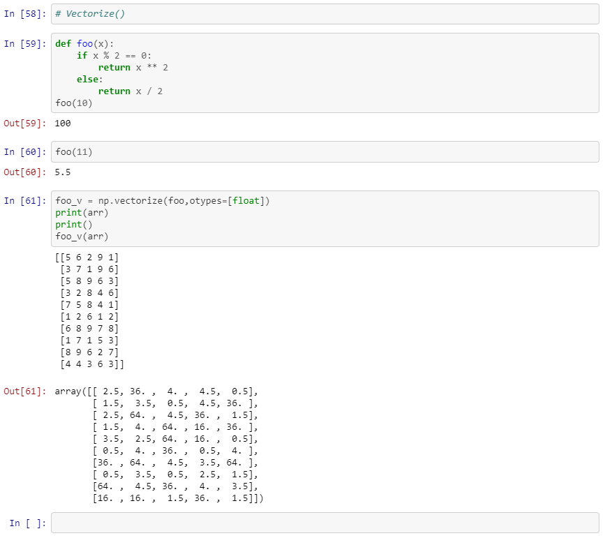

Bibliography
------------

1.  TakenMind Course [Udemy]

2.  Google

3.  Stack Overflow

4.  Wikipedia
