Pandas Documentation
====================

Installation
------------

On Ananconda Distributions, Pandas can be installed using the following command:

~~~~~~~~~~~~~~~~~~~~~~~~~~~~~~~~~~~~~~~~~~~~~~~~~~~~~~~~~~~~~~~~~~~~~~~~~~~~~~~~
conda install pandas
~~~~~~~~~~~~~~~~~~~~~~~~~~~~~~~~~~~~~~~~~~~~~~~~~~~~~~~~~~~~~~~~~~~~~~~~~~~~~~~~

Pandas can also be installed from the command line using pip using

~~~~~~~~~~~~~~~~~~~~~~~~~~~~~~~~~~~~~~~~~~~~~~~~~~~~~~~~~~~~~~~~~~~~~~~~~~~~~~~~
pip install pandas
~~~~~~~~~~~~~~~~~~~~~~~~~~~~~~~~~~~~~~~~~~~~~~~~~~~~~~~~~~~~~~~~~~~~~~~~~~~~~~~~

Series and DataFrames
---------------------

Pandas Series is a labelled 1d array capable of holding data of any type
(int,str,float,objects,etc.) The axis labels are collectively called as index

Pandas DataFrames is a 2d array that is able to store heterogeneous data items
which can input in the form of a dictionary

### Accessing Elements from a Pandas Series/DataFrame

Elements can from a pandas dataframe just like a dictionary

[./media/image2.png](./media/image2.png)
----------------------------------------

Reading CSV Files and inserting them, constructing Pandas Data Frames and viewing the data
------------------------------------------------------------------------------------------

Path can be a chosen as a raw string and feed into pandas via the read_csv(),
read_tsv() or read_table() command as illustrated below:

The path variable must a reference to a tabular datasheet in the user’s local
machine

Once the DataFrame has been created, the top 5 rows can be viewed using the
head() command

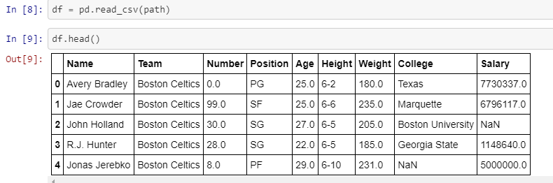

Moreover, the bottom rows can also be viewed using the tail command (). Also, a
desirable number of rows can be passed into the bracket.

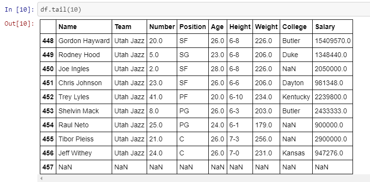

Setting a Different Index
-------------------------

Pandas gives the user an option of setting indices to other data columns using
the index_col parameter in the read_csv command

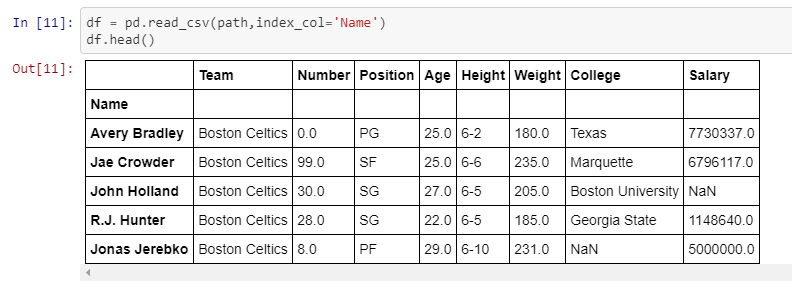

Getting Useful Insights into the data
-------------------------------------

The user can get description of Column names, nullability and data types of the
columns using the info() command

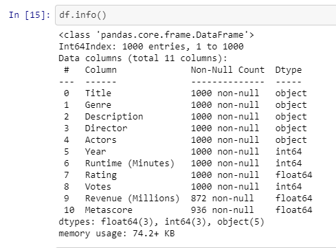

Further, detailed statistics can constructed from the data using the describe()
command.

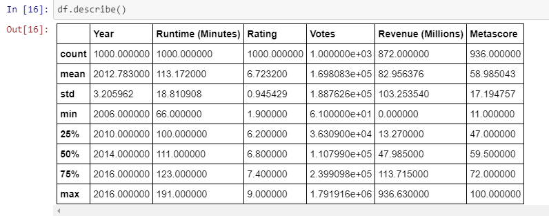

The shape of the Data-Frame can be checked using shape command

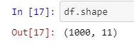

**Checking for Duplicates**

The Data-Frames might contain duplicates and this can be checked using
duplicated () cmd.

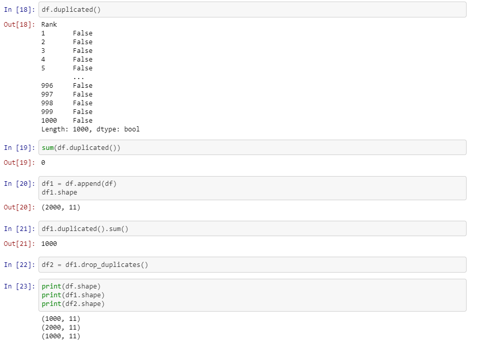

**The columns can be viewed using df.columns**

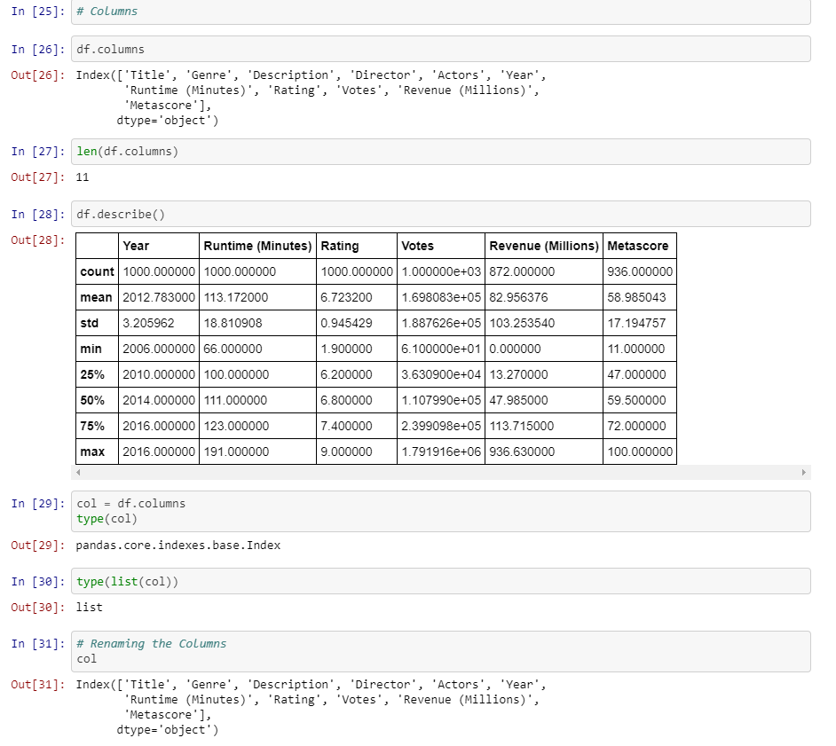

**The columns can also be manipulated using df.columns**

[./media/image11.png](./media/image11.png)
------------------------------------------

**The columns can also be manipulated using df.columns**

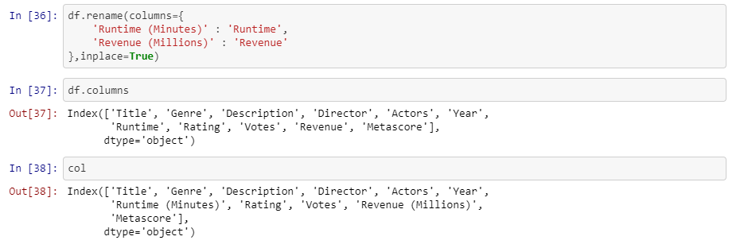

Checking for NULL values in the dataset
---------------------------------------

1.  To check for NULL values in the dataset use the isnull() or isna() cmd

2.  To perform sum use the isnull().sum() cmd.

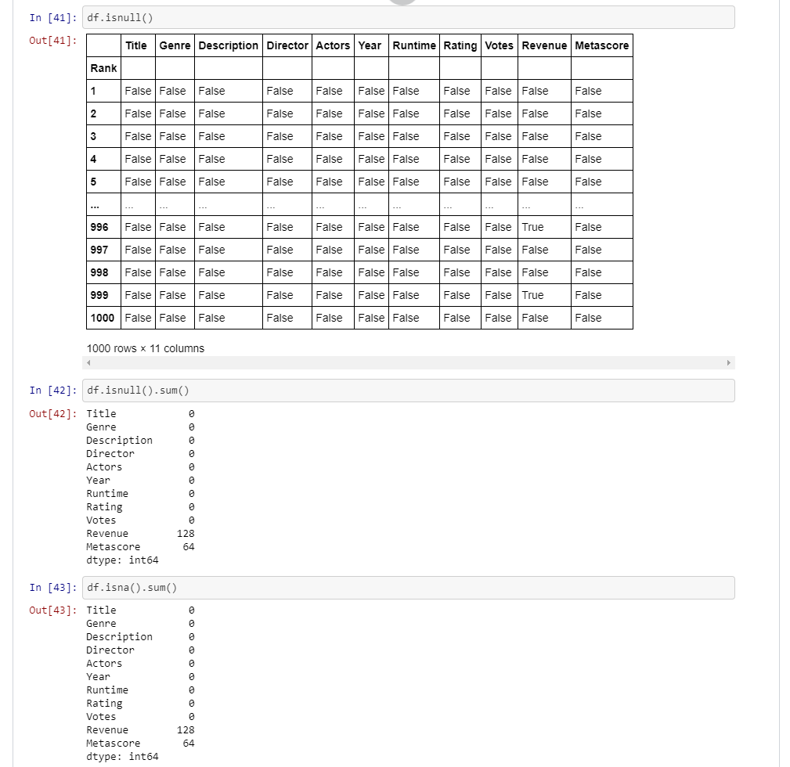

**Gathering Valuable insights into the dataset**

1.  To get the total counts of each category use the value_counts () cmd

2.  To check check for uniqueness in the data use the unique (). This would
    return the number of unique values in a particular Pandas Series.

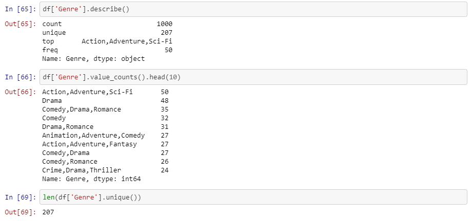

**The Correlation Matrix**

The correlation matrix shows the relationship between various features and can
be implemented using the corr () method.

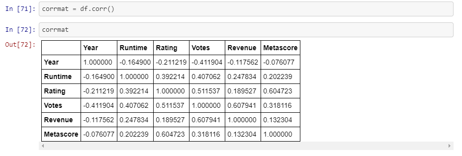

Bibliography
------------

1.  TakenMind Course [Udemy]

2.  Google

3.  Stack Overflow

4.  Wikipedia
